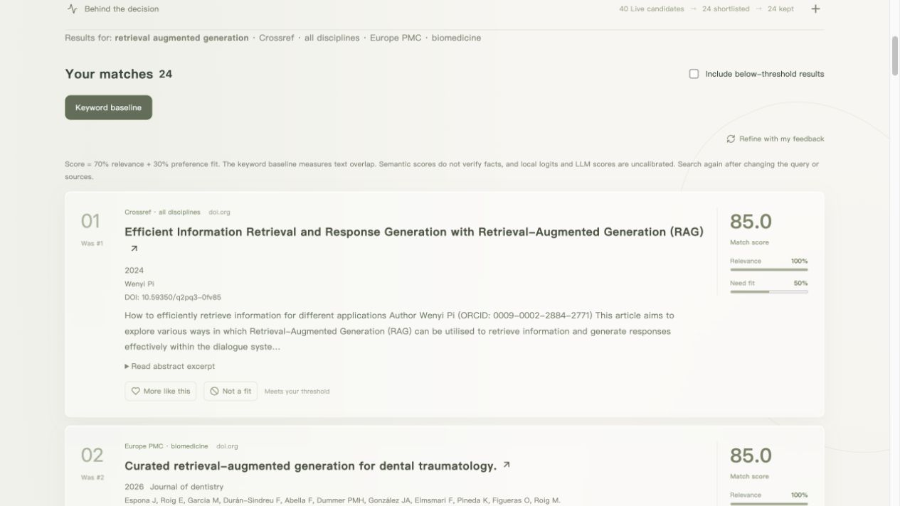
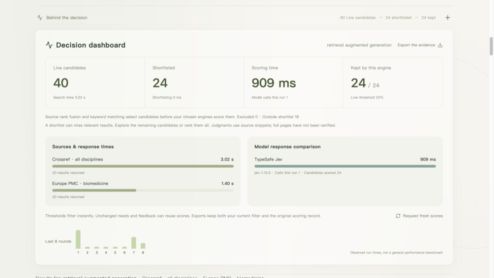
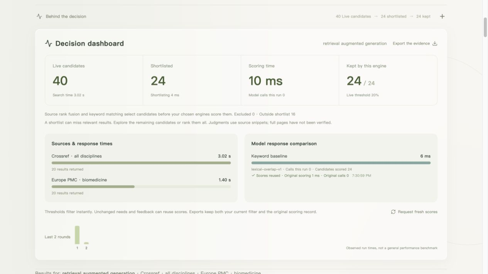
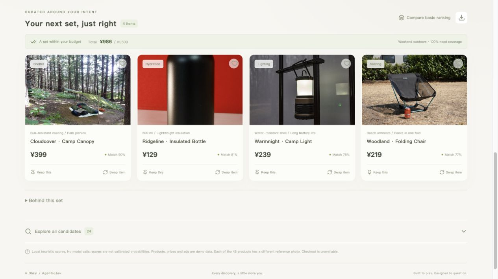

<div align="center">

# ⚡ AgenticJev · 拾意

### 少一点翻找，多一点「刚刚好」。

**Search with intent. Decide with evidence.**

**🔎 免费论文检索 · 🌐 多源发现 · ⚡ 短名单决策 · 🛍️ 约束搭配**

把一句需求变成值得比较的选择：检索真实候选，融合来源排名，按需调用 Jev 或其他模型，再用反馈收敛结果。

暖色磨砂玻璃界面 · English by default · 中英文即时切换

[](https://github.com/FBddcz/agentic-jev/actions)
[](https://github.com/FBddcz/agentic-jev/stargazers)
[](LICENSE)
[](https://nodejs.org/)
[](https://react.dev/)

[👀 看看界面](#gallery) · [🚀 快速上手](#quickstart) · [🔎 搜索原理](docs/SEARCH.md) · [🧠 接入模型](#models) · [🧩 二次开发](docs/EXTENDING.md)


**拾一份心意，发现下一种可能。**

喜欢这种把研究做成可玩应用的方式？点一颗 **⭐ Star**，一起把它变得更好。

</div>

## ✨ 从发现，到选定

| 一步一步缩小选择      | 拾意怎么做                                                                                                               |
| --------------------- | ------------------------------------------------------------------------------------------------------------------------ |
| **01 · 找到真实候选** | Crossref、Europe PMC、GitHub、Hacker News 免 Key 检索；Tavily、Search1API、Brave 可扩展全网。保留链接、摘要与来源快照。  |
| **02 · 先做短名单**   | 融合来源排名与词法相关性，默认最多精选 24 个候选进入评分（喜欢项全部保留）；可切换全部候选，查看哪些结果未参与本轮判断。 |
| **03 · 看懂每次取舍** | 规则、官方 Jev、OpenAI 兼容、Claude 或本地 MiniCPM 对同一份短名单判断。来源耗时、评分耗时、请求数与缓存来源分别可见。    |
| **04 · 用反馈收敛**   | 喜欢、排除后复用来源快照；相同评分上下文可命中缓存。只调整展示阈值时立即筛选，不再发起模型请求。                         |

无模型 Key 时使用明确标注的词法基线，模型调用数为 **0**。短名单减少待判断数量，耗时以实际运行记录为准。它对结果质量的影响，以及不同模型的质量与速度，仍需要真实任务评测。

<a id="gallery"></a>

## 🪟 看看真实运行的拾意

以下是项目实际运行的界面截图，点击可查看原图。

### 检索真实文献，保留可追溯来源

[](docs/discovery-results.png)

_论文结果来自在线公开索引；元数据和可用摘要用于判断，缺少摘要会明确标注。截图中的排序使用本地基线。_

### 让 Jev 的判断与耗时都看得见

[](docs/jev-scoring.png)

_一次实际运行记录：40 个在线论文候选精选为 24 个，`jev-1.13.0` 用 1 次请求完成评分，评分阶段为 909 ms；来源检索另计 3.02 s。这是单次观测，不代表普遍速度或质量优势。_

<table>
<tr>
<td width="50%" valign="top">
<a href="docs/decision-process.png"></a>
<p><strong>每一轮，都有依据</strong><br>展开决策过程，查看实际候选数量、来源状态与本轮耗时。图中使用词法基线，模型调用为 0。</p>
</td>
<td width="50%" valign="top">
<a href="docs/shopping-studio.png"></a>
<p><strong>把选择组合成生活方案</strong><br>从演示目录按预算与偏好搭配，固定喜欢的商品，换一件只改动所选位置。摄影为类别参考，商品数据为合成演示。</p>
</td>
</tr>
</table>

## 🧩 搜索之外，还能探索什么？

- **🛍️ 搭配实验**：48 件演示商品、四个生活场景；预算、数量、固定项与排除项由代码校验，组合 Beam Search 与逐件排序可对照。48 张不同摄影随仓库保存，离线可见。
- **🛒 真实店铺入口**：打开 Amazon / 淘宝天猫 / 京东官方页面；连接搜索后在应用内筛选商品详情链接。尚未接入电商库存、价格或下单接口。
- **👗 照片试衣**：上传人物照与衣服图，连接自部署 FASHN VTON 1.5。未连接时显示真实状态；需要单独部署推理服务。[试衣接入](docs/TRY_ON.md)
- **🏡 家庭场景**：上传自己的房间并预览原图；参考页含 Poly Haven CC0 实拍全景与可编辑 3D 概念客厅。房间照片尚未接图像编辑模型。[场景说明](docs/SCENES.md)
- **🧪 可复现的实验**：比较 2–4 路模型、导出候选与评分证据、保存浏览器预设；商品目录和算法参数可单独配置。

商品名、价格、质量和广告出价是合成演示数据。摄影不是这些虚构商品的实售照片；没有下单或真实广告扣费。作者与许可见 [素材声明](THIRD_PARTY_NOTICES.md)。

论文与技术检索无需 Key；全网搜索需要所选搜索服务的 Key。GPT / Claude / Jev Key 用于判断候选，不会自动开启网页搜索。来源范围、配置、评分与缓存规则见 **[搜索指南](docs/SEARCH.md)**。

<a id="quickstart"></a>

## 🚀 三分钟，把实验室开起来

准备 **Node.js 22.12+** 和 Git。首次安装需要联网，规则基线随后可离线运行。

```bash
git clone https://github.com/FBddcz/agentic-jev.git
cd agentic-jev
npm ci
npm run build
npm start
```

打开 **[http://127.0.0.1:8787](http://127.0.0.1:8787)** → 选择 **Papers / 论文** → 输入英文主题 → **Discover / 发现**，即可免费检索。搭配实验在 **Shopping**；右上角可切换中文。

修改代码用 `npm run dev`。服务只监听本机；手机尺寸适配不等同于已开放局域网访问。搜索快照、当前输入与未保存的购物偏好不跨刷新恢复；保存的方案和语言选择保存在浏览器。模型及搜索连接由本机服务保管，页面输入的 Key 重启后清除。

<a id="models"></a>

## 🧠 给推荐接上不同的大脑

| 入口                   | 如何决策                     | 需要什么                             |
| ---------------------- | ---------------------------- | ------------------------------------ |
| 🎮 本地规则            | 词法、场景、标签与质量公式   | 无 Key / GPU                         |
| ⚡ TypeSafe Jev        | 官方 Noul / Score 语义判断   | TypeSafe 访问权限与官方 Key          |
| 🌐 GPT / 兼容 API      | 生成 JSON 候选自评分         | Base URL、模型 ID、所需 Key          |
| 🟠 Claude 原生         | Anthropic Messages 生成评分  | Anthropic Key、可用模型 ID           |
| 🍎 MiniCPM 直读 logits | 单 token 答案读出 + 前缀复用 | Python 3.11+、推理依赖、约 5 GB 权重 |

右上角 **模型连接** → 选择入口 → 填写并保存 → 在 **决策引擎** 中选择对应模型。保存不会发起模型请求。搜索在发现或重新评分时按需调用；购物中的生成、喜欢、固定、换一件和模型实验会调用所选服务。

Key 不写入浏览器存储、导出、日志或仓库。更换云端连接需要重新填写 Key。普通模型分数、MiniCPM 的未校准条件 softmax 与 Jev 返回值分别标记。

### ⚡ 官方 Jev

到 [TypeSafe](https://typesafe.ai) 申请访问，获准后在 [控制台](https://console.typesafe.ai) 创建 Key。默认模型为 `jev-latest`；实验请记录实际返回版本。官方地址固定为 `https://api.typesafe.ai/v1/systemone`，使用官方 JavaScript SDK。

每个候选有两个问题：**是否与意图相关、是否契合偏好**。搜索默认先精选 24 个候选再评分，也可选全部；购物默认先召回 24 件商品，请求更多推荐时自动扩大候选池。模型边界按每批 24 件依次请求，24 不是商品数量上限。预算、去重和组合约束由代码处理。也可复制 `.env.example` 为 `.env` 配置 Jev。

### 🍎 本地 MiniCPM5-2B

在另一个终端中运行：

```bash
python3 -m venv .venv
source .venv/bin/activate
python -m pip install -r local/requirements.txt
python local/serve.py --device auto
```

Windows PowerShell 用 `.venv\Scripts\Activate.ps1` 激活环境。首次评分会下载并加载固定版本权重；已有缓存可加 `--local-files-only`。默认自动选择 CUDA、MPS 或 CPU。

网页中选择 **MiniCPM 直读 logits**，地址保持 `http://127.0.0.1:8788`，保存即可。`--mode fresh` 关闭前缀复用，`--mode shared` 启用共享前缀；`--batch-size` 控制后缀批量大小。

本地路径已经用真实权重完成小样本与完整推荐链路验证。它借鉴 SemIf 的推理组织方式，**没有复现 TypeSafe 的专有训练或 Jev 权重**。完整接入说明、原理与实测边界见 **[模型指南](docs/MODELS.md)**。

## 🆚 让结果说话

[查看早期 MiniCPM 对照截图与原始实验](docs/comparison.png)

_图中 MiniCPM 使用已加载权重，模型等待约 16.9 秒；它是独立的界面实测，不是官方 Jev 成绩。_

**对照实验** 页面提供两个独立入口：

1. **模型对照**：固定当前意图、预算、反馈与候选逻辑，选 2–4 路依次执行。失败单独展示，不填入替代成绩。
2. **组合算法对照**：12 个固定合成案例中，两种算法共用相同候选和评分，固定 4 件上限与 NDCG@4，比较逐件贪心与 beam search。

```bash
npm test
npm run build
npm run evaluate
# 已配置官方 Key 时，下面会发起 12 次真实 Jev 请求：
node --env-file=.env --import tsx scripts/evaluate.ts --jev
```

规则评分下的合成样本（**0 次 Jev 调用**）：

| 策略     | 需求覆盖 | 预算满足率 | NDCG@4 | 合成效用 |
| -------- | -------: | ---------: | -----: | -------: |
| 逐件排序 |    54.2% |       100% |  0.641 |    0.618 |
| 组合生成 |     100% |       100% |  0.672 |    0.889 |

这组结果用于检验实现与指标。目标函数本身奖励覆盖，12 个手工案例不能证明真实业务收益，也不能证明某个模型更强。协议测试使用夹具；仓库没有预填真实 Jev、GPT 或 Claude 的成绩。

📊 [评价定义](docs/EVALUATION.md) · [规则原始结果](docs/baseline-results.json) · [MiniCPM 读出样本](docs/local-probe.json) · [本地完整对照](docs/local-comparison.json)

## 🔬 决策发生在哪里？

**Retrieve → Shortlist → Judge → Refine**：先找到，再缩小判断范围，最后用反馈收敛。

```text
需求 + 来源 + 偏好
        ↓
并行检索 → URL / DOI 去重 → 保留来源排名与快照
        ↓
来源排名融合 + 词法相关性 → 短名单（或全部候选）
        ↓
相同评分上下文缓存 / 规则 / Jev / 兼容 API / 本地 logits
        ↓
评分 + 来源证据 + 实际耗时
        ↓
阈值即时筛选 / 喜欢 / 排除 → 下一轮
```

购物演示另走 **BM25 / 场景召回 → 候选评分 → 约束 Beam Search → 组合反馈**；它保留预算、固定项和独立模拟赞助位。搜索评分与购物效用有各自公式，不能直接比较。

这里的「智能体」指围绕意图、决策与反馈的交互研究方向。当前实现包括候选重排和从有限目录生成商品组合；没有训练 HSTU / TIGER、生成式 item ID 模型，也没有执行自主下单。向量语义召回、学习用户长期偏好和带证据的文本方案生成仍是后续方向。

接下来的改进应由真实任务衡量：**短名单是否漏掉好结果、整体 p50/p95 耗时、选定所需轮数、接受率，以及失败率与请求成本**。减少候选与复用评分是实现上的优化，不等于已经证明业务收益。

## 🎛️ 把它改成你自己的实验

在页面右上角打开 **实验预设**：保存当前意图、预算、数量、反馈和引擎选择，或导出 JSON 带到另一台电脑。应用预设只修改条件，点击生成后才会调用模型；API Key 不进入预设。

开发时编辑 **`src/catalog.json`** 替换商品或增加场景，编辑 **`src/algorithm.json`** 调整召回数量、排序权重、搜索宽度和广告规则。配置有启动校验，实验导出包含目录与参数指纹。修改后重启开发服务；生产运行重新构建。

固定 12 案例评测使用独立的原始目录和参数快照，避免自定义数据污染旧结果。更大规模目录应接检索索引；组合搜索有可配置计算预算，触及预算会明确提示。

## 🧩 从这里开始二次开发

| 想改什么               | 入口                                      |
| ---------------------- | ----------------------------------------- |
| 商品、场景、默认偏好   | `src/catalog.json`、`src/algorithm.json`  |
| 联网来源、论文与去重   | `server/search.ts`、`src/search-types.ts` |
| 搜索与决策大盘         | `src/SearchLab.tsx`                       |
| 中英文 UI 文案         | `src/i18n/`                               |
| 购物交互与响应式界面   | `src/App.tsx`、`src/styles.css`           |
| 模型连接与对照面板     | `src/ModelPanels.tsx`                     |
| 召回、排序、组合与广告 | `server/engine.ts`                        |
| Jev / 云端 / 本地协议  | `server/jev.ts`、`server/providers.ts`    |
| MiniCPM 读出与前缀复用 | `local/serve.py`                          |
| 固定标签与评价指标     | `server/evaluation.ts`                    |

见 **[扩展指南](docs/EXTENDING.md)**、**[参与贡献](CONTRIBUTING.md)**。优先欢迎真实数据接入、传统 reranker / MMR 基线、可复现失败案例和无障碍改进。

## 🤝 致谢与同系列项目

感谢 [TypeSafe](https://github.com/typesafe-ai) 的官方文档与 SDK，以及 [TheoLeeCJ / SemIf](https://github.com/TheoLeeCJ/SemIf) 对小模型快速决策方法的开放探索。更多项目与来源见 [研究地图](docs/RESEARCH.md)。

🤖 **[EmbodiedJev · 行知](https://github.com/FBddcz/embodied-jev)** 探索具身行动，✳️ **AgenticJev · 拾意** 探索搜广推决策。把想法做成能玩、能测、能继续改的应用。

代码采用 [MIT License](LICENSE)。第三方照片保留各自许可，模型权重另受模型仓库条款约束；本仓库不分发权重。

## ⭐ Star History

[](https://star-history.com/#FBddcz/agentic-jev&Date)

_图表由 Star History 动态生成，随仓库星标记录更新。_
